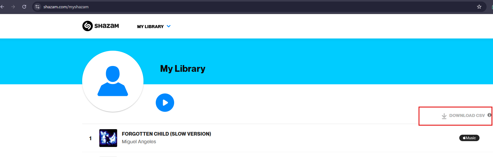
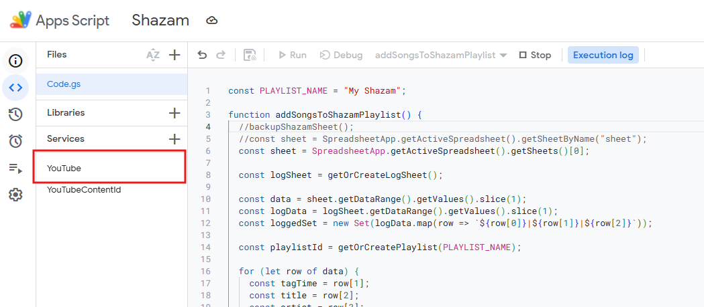
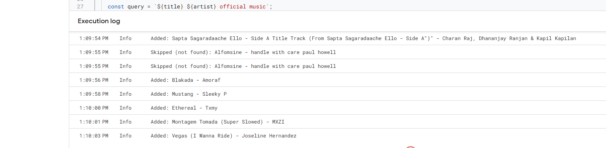
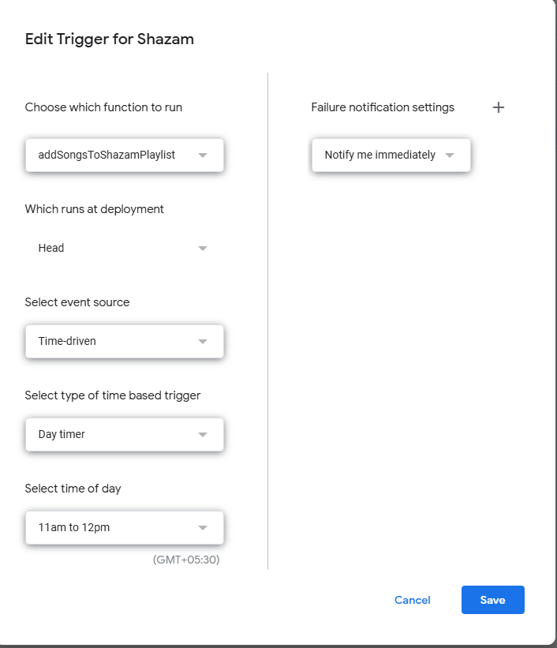

# My Shazam YouTube Playlist Manager

## Description
This project automates the creation and updating of a YouTube playlist named "My Shazam" using a list of your Shazam-discovered music. It utilizes Google Sheets, Google Apps Script, and the YouTube Data API to seamlessly sync your favorite music from Shazam into YouTube, making your music management effortless.

## Installation
Follow these clear, step-by-step instructions to set up your environment:

### Step 1: Clone the Repository
1. Open your terminal or command prompt.
2. Clone the repository:
   ```bash
   git clone https://github.com/Pasanlaksitha/Shazam2YTMusic.git
   ```

### Step 2: Set up Google Sheet
1. Visit [Google Sheets](https://sheets.google.com) and create a new blank spreadsheet.
2. Rename the default sheet to `Sheet1`. Alternatively, if you wish to keep the original sheet name, update the following line in `script.gs` to match your actual sheet name:
   ```javascript
   const sheet = SpreadsheetApp.getActiveSpreadsheet().getSheetByName("YourSheetName");
   ```



3. Import your Shazam CSV data by clicking **File → Import → Upload** and selecting your CSV.
4. Create another tab called `AddedLog` with these column headers:

   ```
   TagTime | Title | Artist | YouTubeVideoID | DateAdded
   ```

### Step 3: Set up Google Apps Script
1. Open your Google Sheet.
2. Click **Extensions → Apps Script**.
3. Replace the default content by copying and pasting the provided script from your cloned repo (file: `Code.gs`) or Copy Paste the JS File Contnet.
4. Save your script (`Ctrl + S`).
5. In the left sidebar, click **+ Services**.
6. Search for `YouTube Data API v3` and click **Add**.

### Step 4 (Optional but Recommended): Link to a Google Cloud Project
To increase your YouTube API quota to 10,000 units/day:
1. Visit [Google Cloud Console](https://console.cloud.google.com).
2. Create a new project (or select an existing one).
3. Enable the **YouTube Data API v3** under **APIs & Services → Library**.
4. Copy the project ID.
5. Go back to **Apps Script → Project Settings**, and paste your project ID in the **Google Cloud Platform (GCP) Project** field.
6. Save changes and re-authorize your script if prompted.



### Step 5: Authorize Google Apps Script
1. In the Apps Script editor, select the function `addSongsToShazamPlaylist`.
2. Run it by clicking the play button ▶️. You’ll see a prompt to authorize the script. Follow the prompts and authorize access.

## Usage

### Manual Run
To manually update your playlist:
1. In your Google Sheet, click **Insert → Drawing**.
2. Create a simple button labeled "Update My Shazam Playlist".
3. Click the three dots (⋮) on the button, select **Assign script**, and enter:
   ```
   addSongsToShazamPlaylist
   ```
4. Clicking this button will now manually update your playlist anytime.



### Automatic Daily Run
To automatically update daily:
1. Open your Apps Script editor.
2. Go to **Edit → Current project's triggers**.
3. Click **Add Trigger**, and configure it:
   - Choose `addSongsToShazamPlaylist`
   - Select **Time-driven** → **Day timer**
   - Choose your preferred daily execution time



## Configuration
Adjust the following in your `Code.gs`:
- Playlist privacy settings (`private`, `unlisted`, `public`) can be edited within the script (see the function `getOrCreatePlaylist`).
- Sleep interval (currently 1 second) to prevent hitting quota limits:
  ```javascript
  Utilities.sleep(1000); // Adjust as necessary
  ```

## Troubleshooting Common Issues

- **Authorization issues:**
  - If you receive a "403 error: Access Denied," ensure you've authorized the correct Google account in Apps Script.

- **YouTube API Quota Exceeded:**
  - If you're not using a linked Google Cloud Project, API usage is limited. Link to a verified project to unlock higher limits (up to 10,000 requests/day).

- **"Cannot read property" errors:**
  - Verify that your Google Sheet tabs (`Sheet1`, `AddedLog`) are named exactly as specified above.

- **Other Execution Errors:**
  - If your script fails to run for any reason, please open an issue in the GitHub repository. Include a **screenshot of the execution error log** from Apps Script to help us resolve the problem quickly.

## License
This project is licensed under the MIT License. See `LICENSE.md` in the repository for details.

## Contact Info
For further help, questions, or suggestions, reach out directly:
- Email: hello@pasanlaksitha.com

Happy listening!

